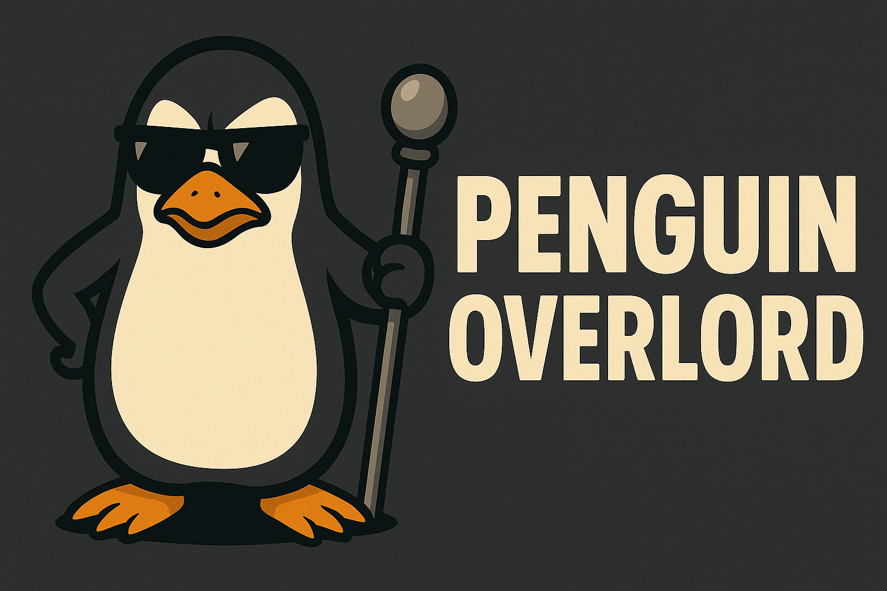

# 🐧 Penguin Overlord

<div align="center">
  
  
  [](https://github.com/ChiefGyk3D/penguin-overlord/pkgs/container/penguin-overlord)
  [](https://www.python.org/)
  [](https://discordpy.readthedocs.io/)
  [](https://opensource.org/licenses/MPL-2.0)
</div>

A feature-rich Discord bot for tech enthusiasts, HAM radio operators, aviation spotters, and cybersecurity professionals! Get tech quotes, XKCD comics, solar weather data, HAM radio news, aviation frequencies, SIGINT resources, and event reminders all in one bot.

## ✨ Features

### 💬 Tech Quote of the Day
Get inspirational, humorous, and insightful quotes from tech legends!

**Commands:**
- `!techquote` or `/techquote` - Get a random quote from any tech legend
- `!quote_linus` or `/quote_linus` - Get a quote from Linus Torvalds
- `!quote_stallman` or `/quote_stallman` - Get a quote from Richard Stallman
- `!quote_hopper` or `/quote_hopper` - Get a quote from Grace Hopper
- `!quote_shevinsky` or `/quote_shevinsky` - Get a quote from Elissa Shevinsky
- `!quote_may` or `/quote_may` - Get a quote from Timothy C. May
- `!quote_list` or `/quote_list` - Browse all available quote authors (interactive paginator!)

**Featured Quote Authors (610+ quotes from 70+ legends):**
- Linux/Unix Pioneers: Linus Torvalds, Dennis Ritchie, Ken Thompson, Rob Pike
- Open Source Champions: Richard Stallman, Eric S. Raymond, Larry Wall
- Language Creators: Guido van Rossum (Python), Yukihiro Matsumoto (Ruby), Bjarne Stroustrup (C++)
- Computer Science Legends: Alan Turing, Ada Lovelace, Grace Hopper, Donald Knuth, Edsger Dijkstra
- Industry Icons: Steve Jobs, Bill Gates, Mark Zuckerberg
- Privacy & Security: Elissa Shevinsky, Timothy C. May, Gene Spafford
- Software Engineering: Fred Brooks, Robert C. Martin, Martin Fowler, Kent Beck
- And many more!

### 🎨 XKCD Commands
- `!xkcd` or `!xkcd [number]` - Get the latest XKCD comic or a specific one by number
- `!xkcd_latest` - Get the latest XKCD comic
- `!xkcd_random` - Get a random XKCD comic
- `!xkcd_search [keyword]` - Search for XKCD comics by keyword in titles (searches last 100 comics)

### 🤖 Automated XKCD Poster
The bot can automatically post new XKCD comics to a configured channel. This is handled by the `xkcd_poster` cog which polls the XKCD API and posts new comics when they appear.

Configuration options (set in your `.env` or via the runtime admin command):

- `XKCD_POST_CHANNEL_ID` — Numeric channel ID where new comics will be posted. Example: `123456789012345678`
- `XKCD_POLL_INTERVAL_MINUTES` — How often to check for new comics (default: `30` minutes)

Admin runtime commands (owner or Manage Server permission required):

- `!xkcd_set_channel <#channel|channel_id>` — Set the automatic post channel
- `!xkcd_enable` / `!xkcd_disable` — Enable or disable the automatic poster
- `!xkcd_post_now` — Force-post the latest XKCD immediately

State persistence:

The cog stores its state in `data/xkcd_state.json` and will create the `data/` directory and file on first run. The file contains `last_posted`, `channel_id`, and `enabled` fields.

### 🎨 Tech Comics Collection
Enjoy tech humor from multiple actively-updated webcomic sources!

**Manual Commands:**
- `!comic` or `!comic random` - Random tech comic from any source
- `!comic xkcd` - Latest XKCD (tech/science/cyber humor)
- `!comic joyoftech` - Latest Joy of Tech (Apple, Linux, geek culture)
- `!comic turnoff` - Latest TurnOff.us (Git/DevOps/programmer humor)
- `!comic_trivia [xkcd_num]` - Get explanation for an XKCD comic from explainxkcd.com

**📰 Daily Tech Comics (Automated):**
The bot can automatically post a random tech comic daily at 9 AM UTC to a configured channel.

Configuration:
- `COMIC_POST_CHANNEL_ID` — Channel ID for daily comic posts (optional, can use runtime command)

Admin runtime commands (owner or Manage Server permission required):
- `!comic_set_channel <#channel>` — Set the daily comic channel
- `!comic_enable` / `!comic_disable` — Toggle daily posting (9 AM UTC)
- `!daily_comic` — Force post a comic immediately

**Comic Sources:**
- 🤓 **XKCD**: Tech, science, and cybersecurity humor (via JSON API: https://xkcd.com/info.0.json)
- 😂 **Joy of Tech**: Apple, Linux, and general geek culture (via https://www.joyoftech.com/joyoftech/jotblog/index.xml)
- 🔧 **TurnOff.us**: Git, DevOps, and programmer humor (via https://turnoff.us/feed.xml)

State persistence: Stored in `data/comic_state.json`

### 🎲 Fun Commands
- `!cyberfortune` - Get a cybersecurity-themed fortune cookie
- `!randomlinuxcmd` - Get a random Linux command from the manpage (250+ commands)
- `!patchgremlin` - Encounter the mischievous Patch Gremlin who might... patch things

### ☀️ Solar & Space Weather (Radiohead)
Real-time space weather conditions for HAM radio operators!
- `!solar` - Current solar conditions (X-Ray flux, solar wind, geomagnetic field)
- `!propagation` - Current HF radio propagation conditions
- `!solarforecast` - 3-day solar activity forecast
- `!hamnews` - Latest HAM radio news and updates
- `!freqtrivia` - Random HAM radio frequency trivia

### ✈️ Aviation (Planespotter)
Aviation frequencies and resources!
- `!avfreq [type]` - Get aviation frequencies (tower, ground, approach, departure, etc.)
- `!avresources` - Useful aviation monitoring resources

### 📡 SIGINT Resources
Intelligence and monitoring resources!
- `!sigint` - Get SIGINT monitoring resources and frequencies
- `!sigintresources` - Comprehensive SIGINT resource list

### 📅 Event Pinger
Never miss a cybersecurity conference or HAM radio event!
- `!events [type]` - List upcoming events (cybersecurity/ham/all)
- `!allevents [type]` - Paginated view of all events
- `!nextevent [type]` - Get the next upcoming event
- `!searchevent <query>` - Search for events by name

**Event Types:**
- 🔐 Cybersecurity conferences (DEF CON, BSides, DerbyCon, etc.)
- 📻 HAM radio events (Hamvention, Field Day, contests, etc.)

### 🎯 Source Code
- `!source_code` - Get the GitHub repository link

All commands support both prefix (`!command`) and slash commands (`/command`)!

## 🚀 Quick Start

### Option 1: Docker (Recommended)

The easiest way to get started:

```bash
# 1. Create .env file with your Discord bot token
cat > .env << 'EOF'
DISCORD_BOT_TOKEN=your_token_here
DISCORD_OWNER_ID=your_user_id
EOF

# 2. Run with docker-compose
docker compose up -d

# 3. Check logs
docker compose logs -f
```

**Or use the pre-built image:**

```bash
docker run -d --name penguin-overlord \
  --env-file .env \
  -v $(pwd)/events:/app/events:ro \
  ghcr.io/chiefgyk3d/penguin-overlord:latest
```

### Option 2: Python (Development)

```bash
# 1. Clone repository
git clone https://github.com/ChiefGyk3D/penguin-overlord.git
cd penguin-overlord

# 2. Create virtual environment
python3 -m venv venv
source venv/bin/activate  # On Windows: venv\Scripts\activate

# 3. Install dependencies
pip install -r requirements.txt

# 4. Create .env file
./scripts/create-secrets.sh

# 5. Run the bot
cd penguin-overlord
python bot.py
```

### Option 3: systemd Service (Production)

```bash
# Install as system service
sudo ./scripts/install-systemd.sh

# Choose deployment mode:
# 1 = Python with venv
# 2 = Docker container

# Service will auto-start on boot!
```

## 📚 Documentation

- **[DEPLOYMENT.md](DEPLOYMENT.md)** - Comprehensive deployment guide
- **[SECRETS_QUICK_REFERENCE.md](SECRETS_QUICK_REFERENCE.md)** - All secret management options
- **[GET_DISCORD_TOKEN.md](GET_DISCORD_TOKEN.md)** - How to get a Discord bot token
- **[DOPPLER_SETUP.md](DOPPLER_SETUP.md)** - Doppler secrets manager setup

## 🔐 Secret Management

The bot supports 5 different secret management methods (checked in priority order):

1. **Doppler** - Production recommended (`DOPPLER_TOKEN`)
2. **AWS Secrets Manager** - Enterprise (`SECRETS_MANAGER=aws`)
3. **HashiCorp Vault** - Enterprise (`SECRETS_MANAGER=vault`)
4. **Environment Variables** - Simple (`DISCORD_BOT_TOKEN`)
5. **.env File** - Development (automatic via python-dotenv)

See [SECRETS_QUICK_REFERENCE.md](SECRETS_QUICK_REFERENCE.md) for detailed examples.

## 🐳 Docker Images

Multi-architecture images available on GitHub Container Registry:

- `ghcr.io/chiefgyk3d/penguin-overlord:latest` - Latest stable
- `ghcr.io/chiefgyk3d/penguin-overlord:v1.0.0` - Specific version
- `ghcr.io/chiefgyk3d/penguin-overlord:main-sha-abc123` - Git commit

**Platforms:** `linux/amd64`, `linux/arm64`

**Security:** All system packages automatically upgraded during build (apt-get upgrade + dist-upgrade)

## 🔧 Development

### Project Structure

```
penguin-overlord/
├── .github/
│   └── workflows/           # CI/CD pipelines
│       ├── ci-tests.yml     # Python 3.10-3.14 testing, linting, security
│       └── docker-build-publish.yml  # Multi-arch Docker builds
├── penguin-overlord/
│   ├── bot.py               # Main bot entry point
│   ├── cogs/                # Bot extensions/features
│   │   ├── xkcd.py          # XKCD commands
│   │   ├── xkcd_poster.py   # Automated XKCD posting
│   │   ├── comics.py        # Multi-source tech comics (Dilbert, CommitStrip, SMBC)
│   │   ├── techquote.py     # Tech Quote commands (610+ quotes!)
│   │   ├── admin.py         # Admin & help commands (6 pages)
│   │   ├── cyberfortune.py  # Cyber fortune cookies
│   │   ├── manpage.py       # Random Linux commands (250+)
│   │   ├── patchgremlin.py  # Patch Gremlin fun
│   │   ├── radiohead.py     # Solar/HAM radio (NOAA APIs)
│   │   ├── planespotter.py  # Aviation frequencies
│   │   ├── sigint.py        # SIGINT resources
│   │   ├── eventpinger.py   # Event reminders (CSV-based)
│   │   └── source_code.py   # GitHub link
│   ├── social/              # Social platform integrations
│   │   ├── discord.py       # Discord webhook platform
│   │   └── matrix.py        # Matrix platform (future)
│   └── utils/               # Utility modules
│       ├── config.py        # Configuration management
│       └── secrets.py       # Secrets management (Doppler/AWS/Vault)
├── events/                  # Event CSV files
│   └── security_and_ham_events_2026_with_types.csv
├── scripts/                 # Installation & management scripts
│   ├── install-systemd.sh   # systemd service installer
│   ├── uninstall-systemd.sh # Service removal
│   └── create-secrets.sh    # Interactive .env creator
├── Dockerfile               # Multi-stage Python 3.14-slim
├── docker-compose.yml       # Easy Docker deployment
├── requirements.txt         # Python dependencies
├── .env.example            # Example environment variables
├── DEPLOYMENT.md           # Deployment guide
├── SECRETS_QUICK_REFERENCE.md  # Secret management guide
└── README.md               # This file
```

### CI/CD Pipeline

**Automated Testing (Python 3.10-3.14):**
- Bot structure validation
- Import tests for all cogs
- Ruff linting
- Bandit security analysis
- Safety dependency checks

**Docker Builds:**
- Multi-architecture: amd64, arm64
- Trivy security scanning
- Auto-publish to ghcr.io on main branch
- Build-only for pull requests

### Adding New Features

To add a new feature/command set:

1. Create a new cog file in `penguin-overlord/cogs/`
2. Follow the pattern in existing cogs (e.g., `xkcd.py`)
3. The bot will automatically load it on startup!

Example cog structure:
```python
from discord.ext import commands

class MyCog(commands.Cog):
    def __init__(self, bot):
        self.bot = bot
    
    @commands.hybrid_command()
    async def mycommand(self, ctx):
        """My command description"""
        await ctx.send("Hello!")

async def setup(bot):
    await bot.add_cog(MyCog(bot))
```

### Running Tests

```bash
# Lint code
ruff check penguin-overlord/

# Security scan
bandit -r penguin-overlord/ -ll

# Dependency vulnerabilities
safety check --json

# Run all CI checks locally
pip install ruff bandit safety
ruff check penguin-overlord/
bandit -r penguin-overlord/ -ll
safety check
```

### Current Features (30 Commands, 10 Cogs)
- ✅ XKCD comic integration with search
- ✅ Tech Quote of the Day (610+ quotes from 70+ tech legends)
- ✅ Interactive paginators (quotes, events, help)
- ✅ Hybrid commands (both prefix and slash commands)
- ✅ Doppler/AWS/Vault secrets management
- ✅ Solar weather & HAM radio (NOAA APIs)
- ✅ Aviation frequencies & SIGINT resources
- ✅ Event reminder system (29 events, CSV-based)
- ✅ Fun commands (fortune, manpage, patch gremlin)
- ✅ 6-page paginated help system
- ✅ Docker multi-arch support
- ✅ CI/CD with GitHub Actions
- ✅ systemd service support

### Future Features
- 🔲 Matrix bot integration
- 🔲 Scheduled daily tech quotes
- 🔲 Automated event reminders (cron-based)
- 🔲 More SIGINT frequency databases
- 🔲 Games and interactive features
- 🔲 Moderation tools
- 🔲 Custom per-server configurations

## 🤝 Contributing

Contributions are welcome! Here's how you can help:

1. **Fork the repository**
2. **Create a feature branch** (`git checkout -b feature/amazing-feature`)
3. **Make your changes** (follow existing code style)
4. **Test locally** (ensure bot runs and commands work)
5. **Commit your changes** (`git commit -m 'Add amazing feature'`)
6. **Push to your branch** (`git push origin feature/amazing-feature`)
7. **Open a Pull Request**

### Contribution Guidelines

- Follow PEP 8 style guidelines
- Use type hints where possible
- Add docstrings to new functions/commands
- Test your changes before submitting
- Update documentation if needed

## 🆘 Support

If you encounter any issues or have questions:

1. **Check Documentation**: Review [DEPLOYMENT.md](DEPLOYMENT.md) and [SECRETS_QUICK_REFERENCE.md](SECRETS_QUICK_REFERENCE.md)
2. **Bot Token**: Verify your Discord bot token is correct
3. **Permissions**: Ensure bot has necessary Discord server permissions
4. **Console Logs**: Check logs for error messages
5. **Message Intent**: Enable "Message Content Intent" in Discord Developer Portal
6. **Open an Issue**: If problems persist, [open a GitHub issue](https://github.com/ChiefGyk3D/penguin-overlord/issues)

## 📜 License

This Source Code Form is subject to the terms of the Mozilla Public License, v. 2.0.
If a copy of the MPL was not distributed with this file, You can obtain one at https://mozilla.org/MPL/2.0/.

---

## 💝 Donations and Tips

If you find Penguin Overlord useful, consider supporting development:

**Donate**:

<div align="center">
  <table>
    <tr>
      <td align="center"><a href="https://patreon.com/chiefgyk3d?utm_medium=unknown&utm_source=join_link&utm_campaign=creatorshare_creator&utm_content=copyLink" title="Patreon"></a></td>
      <td align="center"><a href="https://streamelements.com/chiefgyk3d/tip" title="StreamElements"></a></td>
    </tr>
    <tr>
      <td align="center">Patreon</td>
      <td align="center">StreamElements</td>
    </tr>
  </table>
</div>

### Cryptocurrency Tips

<div align="center">
  <table style="border:none;">
    <tr>
      <td align="center" style="padding:8px; min-width:120px;">
        
      </td>
      <td align="left" style="padding:8px;">
        <b>Bitcoin</b><br/>
        <code style="font-size:12px;">bc1qztdzcy2wyavj2tsuandu4p0tcklzttvdnzalla</code>
      </td>
    </tr>
    <tr>
      <td align="center" style="padding:8px; min-width:120px;">
        
      </td>
      <td align="left" style="padding:8px;">
        <b>Monero</b><br/>
        <code style="font-size:12px;">84Y34QubRwQYK2HNviezeH9r6aRcPvgWmKtDkN3EwiuVbp6sNLhm9ffRgs6BA9X1n9jY7wEN16ZEpiEngZbecXseUrW8SeQ</code>
      </td>
    </tr>
    <tr>
      <td align="center" style="padding:8px; min-width:120px;">
        
      </td>
      <td align="left" style="padding:8px;">
        <b>Ethereum</b><br/>
        <code style="font-size:12px;">0x554f18cfB684889c3A60219BDBE7b050C39335ED</code>
      </td>
    </tr>
  </table>
</div>

---

<div align="center">

Made with ❤️ by [ChiefGyk3D](https://github.com/ChiefGyk3D)

## Author & Socials

<table>
  <tr>
    <td align="center"><a href="https://social.chiefgyk3d.com/@chiefgyk3d" title="Mastodon"></a></td>
    <td align="center"><a href="https://bsky.app/profile/chiefgyk3d.com" title="Bluesky"></a></td>
    <td align="center"><a href="http://twitch.tv/chiefgyk3d" title="Twitch"></a></td>
    <td align="center"><a href="https://www.youtube.com/channel/UCvFY4KyqVBuYd7JAl3NRyiQ" title="YouTube"></a></td>
    <td align="center"><a href="https://kick.com/chiefgyk3d" title="Kick"></a></td>
    <td align="center"><a href="https://www.tiktok.com/@chiefgyk3d" title="TikTok"></a></td>
    <td align="center"><a href="https://discord.chiefgyk3d.com" title="Discord"></a></td>
    <td align="center"><a href="https://matrix-invite.chiefgyk3d.com" title="Matrix"></a></td>
  </tr>
  <tr>
    <td align="center">Mastodon</td>
    <td align="center">Bluesky</td>
    <td align="center">Twitch</td>
    <td align="center">YouTube</td>
    <td align="center">Kick</td>
    <td align="center">TikTok</td>
    <td align="center">Discord</td>
    <td align="center">Matrix</td>
  </tr>
</table>

</div>
